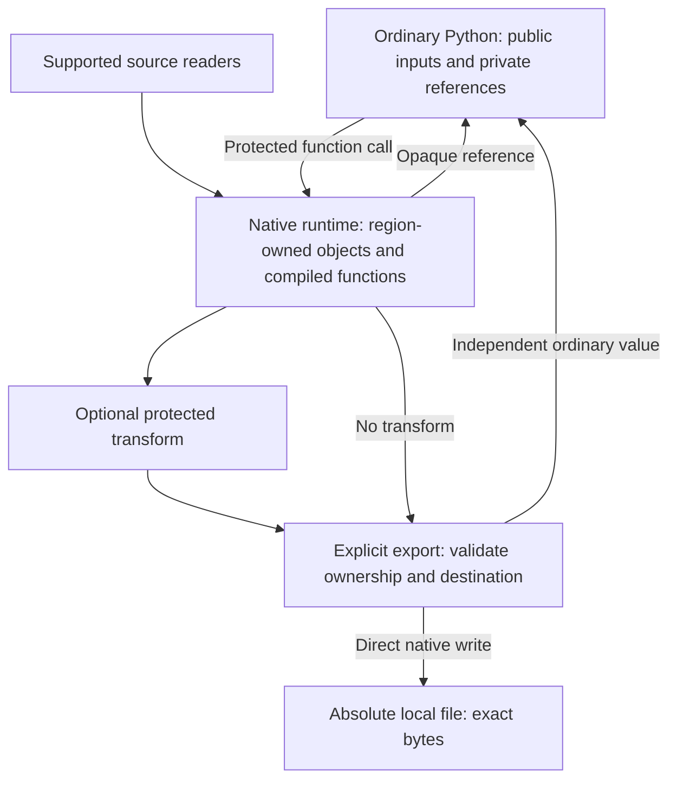

# privpy — final API draft

A region owns private data. Protected functions compute on it. Explicit export authorizes disclosure to ordinary Python or an exact local file.

This is an API and execution design. It does not, by itself, establish hardware memory isolation.

## Public API

```python
with PrivateRegion() as region:
    private_result = protected_function(public_input)
    public_result = region.export(private_result)
    region.export(private_result, to=Path("/absolute/output.csv"), transform=as_csv)
```

```python
@private_function
def protected_function(...):
    ...

region.export(value, *, to=None, transform=None)
```

There is no named policy, general-purpose load method, manual run method, format argument, or destination alias.

## Region

The context manager owns private objects and their lifetime and establishes the active region. The surrounding Python block executes normally. Decorated functions execute in the protected runtime.

Every private reference belongs to exactly one region. References from another region are rejected. Closing the region, including on exception, invalidates all its references. Exported copies and files survive independently.

Ordinary Python arguments can be copied into computations. Their original copies remain public. Private source readers retrieve and parse their inputs inside the runtime; their source must itself be protected if confidentiality before retrieval matters.

## Protected functions

Decorated functions accept supported public arguments and private references. Their implementation is compiled or interpreted by the protected runtime, never executed as an ordinary Python callback with plaintext inputs.

Calls use ordinary syntax and automatically dispatch to the active region. Calls between protected functions remain inside. A call without an active region fails.

All intermediate and returned objects remain private: scalars, strings, collections, arrays and supported dataframes. Comparisons, lengths, schemas and aggregates receive no automatic exemption. Branches and loops can use private conditions inside the runtime. Unsupported operations fail; there is no plaintext fallback to host Python.

Outside the runtime, results are opaque references. They can be passed to protected functions or exported. They cannot expose contents through conversion, iteration, indexing, truth testing, attribute access or serialization. Their representation is a fixed placeholder.

## Export

`export` is the application's deliberate authorization to disclose. It checks mechanics, not whether the data is semantically safe to reveal. The application developer is trusted to choose outputs. Deliberately exporting an original secret is permitted.

Arguments:

| Argument | Meaning |
| --- | --- |
| `value` | A private reference owned by the active region |
| `transform` | Optional protected function accepting one value and returning a private result |
| `to=None` | Return an independent supported Python value |
| `to=Path(...)` | Write bytes directly to that absolute local file; return `None` |

The optional transform runs inside the region. Its result remains private until export. With no transform, the value must already be suitable for its destination. File destinations require bytes; there is no inferred serialization, encoding or encryption. Existing files are not overwritten. Aliases, relative paths, URLs, file objects and callbacks are not supported as destinations in the initial API.

```python
region.export(value, to=path, transform=as_csv)
```

is equivalent to:

```python
encoded = as_csv(value)
region.export(encoded, to=path)
```

Saved plaintext is disclosed. Confidential persistence uses a protected transform that serializes and encrypts to bytes, plus a protected reader that reverses it later. Key management and a secure encryption integration must exist before that feature can be claimed. File extensions never select these behaviors.

## Target dataframe example

The following illustrates the eventual supported-integration API, not unrestricted pandas or SDK compatibility:

```python
@private_function
def read_orders():
    token = secrets.get("payments-token")
    records = payments.fetch_orders(token)
    return DataFrame(records)

@private_function
def summarize(orders):
    paid = orders[orders["status"] == "paid"]
    return paid.groupby("country", as_index=False)["amount"].sum()

@private_function
def as_csv(frame):
    return frame.to_csv(index=False).encode("utf-8")

with PrivateRegion() as region:
    totals = summarize(read_orders())
    region.export(totals, to=Path("/reports/monthly.csv"), transform=as_csv)
```

Source retrieval, credential handling and library operations require supported runtime integrations. Neither a decorator nor moving a pointer makes an arbitrary Python SDK safe to execute on private data.

## Execution sketch



## Initial implementation boundary

The first module uses a native C++ runtime with a restricted Python-syntax interpreter. Python compiles function source into a data-only representation. Private function evaluation, local variables, source parsing, results and file-output bytes live in native storage. The Python interface receives handles until explicit export.

Initial supported data: bounded integers, finite floats, booleans, null, UTF-8 strings, bytes, lists and string-keyed records. Initial computations include assignments, expressions, comparisons, branches, loops and calls between protected functions. File readers and JSON/CSV byte encoders provide a concrete end-to-end vertical slice.

Full dataframe engines, real secrets-manager SDKs, HTTP clients, encryption, arbitrary Python modules, asynchronous functions and custom Python classes are future integrations, not implicit compatibility promises.

The prototype targets accidental disclosure through supported language operations. It does not protect against hostile code with unrestricted native-memory access, a debugger, a compromised runtime, process dumps, timing/termination/error side channels or an application developer deliberately exporting secrets. Native resource release is not a guarantee of complete zeroization of allocator memory, registers or operating-system copies. Normal Python handles do not hold the plaintext object graph.

A production backend would need security review, memory-management hardening, further resource limits and a defined threat model. A strong enclave or process-isolation backend can use the same public API, but is not implemented by this prototype.

## Background

- [Python context-manager semantics](https://docs.python.org/3/reference/compound_stmts.html#the-with-statement)
- [Native memory access through Python](https://docs.python.org/3/library/ctypes.html)
- [Information flow, including exceptional control flow](https://www.cs.cornell.edu/jif/doc/jif-3.3.0/label_checking.html)
