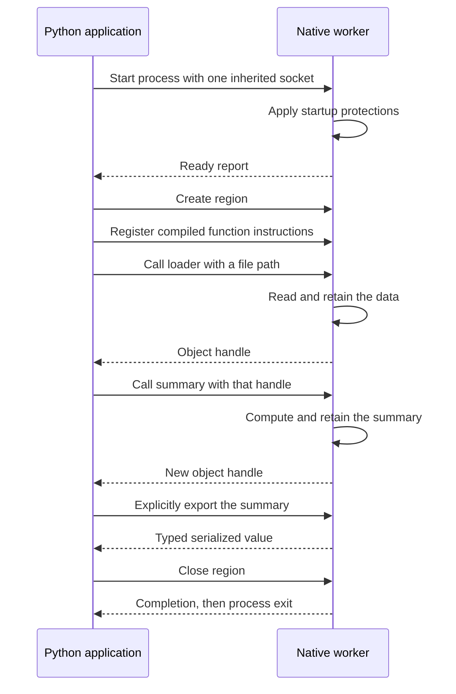

# Study the local worker prototype

This is an experimental implementation of the subprocess design we discussed, developed on `worker-process-isolation`. One native executable owns one region. Python sends requests over a socket and receives opaque handles. The existing interpreter performs the computation inside that executable.

Select it by changing one import:

```python
from privpy import private_function
from privpy.worker import PrivateRegion
```

The default import from `privpy` still selects the original backend. The worker experiment is built from this checkout; it is not part of the installed release.

## Run it

From this directory, using the project's Python virtual environment:

```sh
PYTHONPATH=src python -m privpy.build --worker
PYTHONPATH=src python examples/worker_region.py
```

The example prints different parent/worker process IDs, the startup protection report, two opaque references, an explicitly exported summary, and confirmation of shutdown. Its sample data is public. With the included sample, the exported summary is:

```python
{"paid_orders": 3, "total": 2200}
```

An optional `--output` argument takes an absolute, previously nonexistent path. In that mode the worker encodes and writes the report directly; the bridge returns only completion.

## Read these files in order

1. [examples/worker_region.py](examples/worker_region.py): the user-facing load → compute → export example.
2. [src/privpy/worker.py](src/privpy/worker.py): the small region subclass. It changes the backend factory and exposes public process metadata for this experiment.
3. [src/privpy/_worker.py](src/privpy/_worker.py): the parent-side bridge. Follow initialization, `_exchange`, `call`, `export_value`, and `_shutdown`.
4. [src/privpy/native/worker.cpp](src/privpy/native/worker.cpp): the executable. Follow startup protections, framed input, dispatch, and cleanup.
5. [src/privpy/_core.py](src/privpy/_core.py): the existing compiler registration, ownership, reference and export rules. The new factory hook lets those rules use either backend.
6. [tests/test_worker.py](tests/test_worker.py): executable examples of the protocol, lifecycle, disclosure boundary and failure cases.

For this study version, `worker.cpp` includes the existing `runtime.cpp` directly. The native interpreter is reused, not rewritten or executed by Python. The default shared library and the worker are separate build products.

## Follow a call across the boundary



Entering a region launches an executable with a fresh program image. The launcher passes only one socket endpoint, discards standard streams, and constructs a minimal environment. It does not pass Python objects, callbacks, inherited loader settings, or the caller's environment secrets into the worker.

The worker establishes its startup protections before accepting a region, functions, or data. Missing executables, failed startup, and broken connections produce `WorkerError`; there is no fallback to the original backend.

The compiler still runs in Python because function source is public. It produces the existing restricted instruction representation. Instructions are registered once per region. A call sends a function identifier plus public arguments or private handles. Calls between private functions stay within the worker, so a private loop does not require a message for every iteration.

The worker owns its native object table. A returned handle identifies an entry in that table; it is not a pointer into Python's address space. The connection selects the worker session. There is no shared listener or multi-client service, and handles from separate connections are not global capabilities.

## The wire format

Each frame contains a four-byte unsigned length in network byte order, then UTF-8 JSON. Both sides handle partial socket reads. Frames are limited to 32 MiB. Illustrative call and response:

```json
{"op":"call","name":"compiled-function-id","arguments":[{"ref":1}]}
```

```json
{"ok":true,"result":2}
```

Here the reply contains a handle, not the calculation's value. Explicit export is a different operation:

```json
{"op":"export_value","handle":2}
```

```json
{"ok":true,"result":["int","2200"]}
```

The existing typed wire encoding distinguishes integers, floats, bytes, strings and containers. Only the export operation decodes private data into ordinary Python values. File export returns `null` completion and writes bytes in the worker. Errors contain fixed categories rather than source values. Neither side logs frames.

## Lifetime and failures

- Normal context exit releases the region, closes the connection, and waits for the worker to exit.
- An exception in the context body still closes the worker.
- Loss of the parent connection makes an idle worker release its region and exit. If computation is already running, it discovers the disconnect when it next communicates.
- The parent uses a 30-second deadline per request. Timeout, worker death or invalid replies close the connection and reap the worker, terminating it if needed. Existing handles cannot be silently reused in a new worker.
- Resource-limit or computation errors are ordinary responses; they leave the connection usable.
- Parent requests are serialized. Copied thread contexts can use the region. Reusing a region after a Python fork is unsupported; the transport rejects requests from a different process ID.

## What the protection means

On this Mac, the worker successfully disables core dumps and requests `PT_DENY_ATTACH` before sending its ready report. The Linux branch requests non-dumpability and no-new-privileges in addition to disabling core dumps. Required startup calls fail closed.

This establishes a distinct address space and applies these specific controls. It is a study prototype, not an audited secrecy boundary. A successful startup report establishes that the control calls succeeded; it does not prove resistance to every debugger or memory-inspection mechanism. Linux execution is covered by the branch's CI workflow; see its actual run results before treating it as verified. macOS task-port permissions, executable signing/entitlements, privileged inspection, total worker memory quotas, and operating-system sandbox policies need separate evaluation.

The launcher, executable, interpreter and operating system remain trusted. The authorized caller can still request explicit export. Source-file permissions are unchanged: a worker reading a file does not hide that file from another process already allowed to read it. Data supplied publicly from Python and immutable globals compiled from Python were already present in the caller. This prototype also adds frame-size, transport nesting and timeout limits, and does not claim identical resource-boundary behavior to direct library calls. It does not add protected allocation, swap protection, guaranteed zeroization or side-channel defenses.

The inspection probes begin after the worker's protection handshake. They do not test an attacker that acquires a debugging relationship or inspection handle before startup protections, privileged debuggers, inherited Mach ports, or a compromised launcher. These are distinct threat cases; a denial in the measured cases does not settle them.

## Test it

```sh
# Worker-specific tests, including four Hypothesis properties.
PYTHONPATH=src python -m unittest tests.test_worker -v

# Existing API tests routed through the worker, plus the worker tests.
PYTHONPATH=src python scripts/check_worker.py

# Actual OS inspection attempts against fresh child processes, plus controls.
PYTHONPATH=src python scripts/probe_worker_memory.py --json inspection.json

# Warm local comparison; reports medians without timing-based test failures.
PYTHONPATH=src python scripts/benchmark_worker.py --json benchmark.json

# Capture UBSan stderr from synthetic worker tests (normally discarded).
PYTHONPATH=src python -m privpy.build --worker --sanitize --output /absolute/worker-sanitized
PYTHONPATH=src PRIVPY_WORKER=/absolute/worker-sanitized python scripts/check_worker.py --sanitizer-log sanitizer.log
```

The contract runner uses 25 generated examples per property and 15 state-machine steps to keep process creation bounded. `--examples` increases the property budget. The dedicated worker properties cap themselves at 50 examples. Raw native-ABI fuzz tests still exercise the shared-library ABI directly; the public region API is rerouted through workers.

Worker-specific tests skip explicitly when the executable has not been built. `check_worker.py` instead fails immediately if it is missing, so a worker validation run cannot silently succeed with those tests skipped.

## Local verification

Verified on macOS ARM64:

| Check | Result |
| --- | --- |
| Example: direct worker load, private summary, explicit export, shutdown | Passed |
| Default backend plus worker and study tests, Python 3.12 | 269 tests passed |
| Public region API routed through workers, bounded property profile | 269 tests passed |
| Same worker contract suite with an UndefinedBehaviorSanitizer executable | 269 tests passed; captured diagnostics contained no sanitizer errors |
| Worker and study tests on Python 3.9 | 31 tests passed |
| Combined Python statement/branch coverage, including the new bridge | 94%; above the existing 90% floor |

The 25 transport tests include four Hypothesis properties. Tests inspect protocol replies to check that loader contents stay out of the parent reply until export. Six additional study tests cover interpretation of inspection evidence (including three Hypothesis properties) and the correctness of every benchmark workload. They do not establish that the operating system denies every possible memory-inspection route.

## Inspection results on the development Mac

The native probe runs as an ordinary user and creates its own targets. Each case uses a fresh executable process. The control fixture publishes the address of a synthetic byte so a successful read can be verified. The production worker uses its normal startup protection path, with no test-only protocol or disabled controls. If Mach access is granted, the probe attempts a one-byte read from a readable mapping. No memory contents, addresses, PIDs, user names or local paths are saved in the JSON report.

| Route | Unprotected control | Actual worker | Interpretation |
| --- | --- | --- | --- |
| `task_for_pid` followed by `mach_vm_read_overwrite` | Task port unavailable, code 5 | Task port unavailable, code 5 | Inconclusive: neither target could be inspected |
| Legacy `ptrace` attach | Permission denied | Attaching probe received SIGSEGV | Denial signal observed, but control failed |
| `ptrace(PT_ATTACHEXC)` | Permission denied | Attaching probe received SIGSEGV | Denial signal observed, but control failed |

Apple documents the attaching parent's signal behavior for [PT_DENY_ATTACH](https://developer.apple.com/library/archive/documentation/System/Conceptual/ManPages_iPhoneOS/man2/ptrace.2.html). The signal is handled only during the isolated probe's attach attempt, and its owned target is terminated and reaped. Core dumps are disabled for the probe as well. The runner never changes entitlements, signs executables, requests elevated privileges, or accepts an arbitrary PID to inspect.

On Linux the probes attempt `process_vm_readv`, opening and reading `/proc/PID/mem`, and `ptrace` attach. Both memory-read routes use Linux's ptrace permission checks: [process_vm_readv](https://man7.org/linux/man-pages/man2/process_vm_readv.2.html), [proc_pid_mem](https://man7.org/linux/man-pages/man5/proc_pid_mem.5.html). If an address cannot be obtained, a bad-address error is an error/inconclusive result, never proof of denial. A successful task-port acquisition is reported as exposure even if the subsequent sample read fails.

The script exits 0 only if every tested route has a working control and worker denial, 1 for exposure or probe error, and 2 when a control is inaccessible. This Mac returned 2. It demonstrates observed denials in this execution context, without attributing all of them to our implementation.

## Initial performance measurements

macOS ARM64, Python 3.12, seven samples per case; median microseconds per operation. These are development measurements on one machine with warm caches, not throughput guarantees.

| Operation | Direct backend | Worker | Worker/direct |
| --- | ---: | ---: | ---: |
| Open and close one region | 2.0 µs | 4,161 µs | 2,072× |
| Registered scalar function call | 8.1 µs | 24.7 µs | 3.06× |
| Export one scalar | 1.5 µs | 15.7 µs | 10.64× |
| Pass 64 KiB public bytes | 895 µs | 1,875 µs | 2.10× |
| Export 64 KiB bytes | 659 µs | 1,639 µs | 2.49× |
| Load a cached 1 MiB file privately | 160 µs | 273 µs | 1.71× |
| Group 1,000 private rows | 1,672 µs | 1,548 µs | 0.93× |
| 100 private calls driven by Python | 791 µs | 2,201 µs | 2.78× |
| Same 100 calls inside one private function | 513 µs | 549 µs | 1.07× |

Creation/registration and result validation are outside the timed workloads, except for the region-lifecycle row. Warm-up runs use the same operations. Each sample has a fresh region to bound retained native objects. Large exports measure conversion and serialization as well as IPC. The small apparent advantage in grouped computation should be treated as variation, not a worker speedup claim. These tests do not measure concurrent throughput, peak memory, cold filesystem access, or adversarial workloads.

The useful design direction is to keep a region open for a workload and compose private functions inside it. The example's API already allows this; no new batching concept is needed.

## Remote branch checks

`.github/workflows/worker.yml` runs on pull requests and on `main`, and can be started manually on a branch. It covers Linux x86-64/ARM64 and macOS Intel/ARM64, with additional Python 3.9 and 3.14 jobs. Each job builds both backends, checks coverage, routes the full API contract through workers, runs OS inspection probes, and runs the worker contracts under UBSan with captured diagnostics. Python 3.12 jobs also attach benchmark reports. Test dependencies use separate compatible pins for Python 3.9.

Linux inspection checks require working controls. macOS controls can be denied by the runner's broader permissions, so an inconclusive result emits a visible workflow warning and remains explicitly inconclusive in the attached JSON. Exposure or probe errors fail on either platform. A green macOS job alone is therefore not proof of inspection resistance. Artifacts retain coverage, inspection outcomes, benchmark statistics and sanitizer diagnostics. No workflow here publishes a package or merges the branch.
